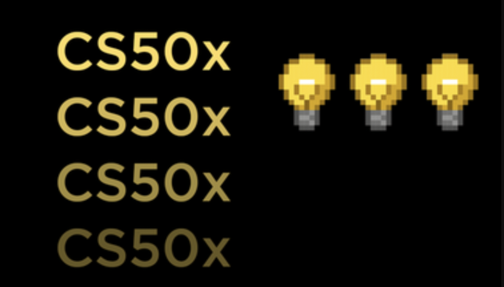

# CS50x 2022

  

CS50x 2022 Edition

Check out the [CS50x 2022 Edition](https://cs50.harvard.edu/x/2022/)!

## Current Progress

### ✅ Week 1
  - ✅ [Hello](https://cs50.harvard.edu/x/2022/psets/1/hello/)
  - ✅ [Mario(less)](https://cs50.harvard.edu/x/2022/psets/1/mario/less/)
  - ✅ [Mario(more)](https://cs50.harvard.edu/x/2022/psets/1/mario/more/)
  - ✅ [Cash](https://cs50.harvard.edu/x/2022/psets/1/cash/)
  - ✅ [Credit](https://cs50.harvard.edu/x/2022/psets/1/credit/)

### ✅ Week 2
  - ✅ [Lab](https://cs50.harvard.edu/x/2022/labs/2/)
  - ✅ [Readability](https://cs50.harvard.edu/x/2022/psets/2/readability/)
  - ✅ [Caesar](https://cs50.harvard.edu/x/2022/psets/2/caesar/)
  - ✅ [Substitution](https://cs50.harvard.edu/x/2022/psets/2/substitution/)

### ❌ Week 3
  - ✅ [Lab](https://cs50.harvard.edu/x/2022/labs/3/)
  - ✅ [Plurality](https://cs50.harvard.edu/x/2022/psets/3/plurality/)
  - ✅ [Runoff](https://cs50.harvard.edu/x/2022/psets/3/runoff/)
